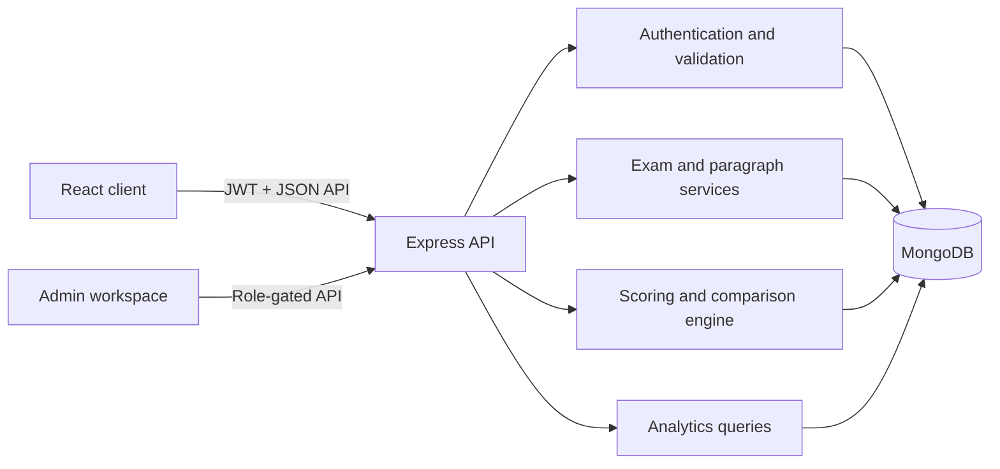

# SAS Academy Typing Platform

A full-stack typing practice and examination platform for competitive-exam preparation. SAS Academy provides server-authoritative scoring, automatic exam-mode selection, character-accurate result analysis, performance analytics, and a complete administration workspace.

Built with React, Express, MongoDB, and Node.js.

## Contents

- [Highlights](#highlights)
- [Exam modes](#exam-modes)
- [Scoring](#scoring)
- [Architecture](#architecture)
- [Technology stack](#technology-stack)
- [Local development](#local-development)
- [Environment variables](#environment-variables)
- [Administrator accounts](#administrator-accounts)
- [Available scripts](#available-scripts)
- [API overview](#api-overview)
- [Deployment](#deployment)
- [Testing](#testing)
- [Security](#security)
- [Troubleshooting](#troubleshooting)

## Highlights

### Learner experience

- English and Hindi typing tests
- Automatic TCS/NTA mode selection for actual exams
- Customizable Practice mode with timer, backspace, word highlighting, sound, auto-scroll, font size, and theme controls
- Server-controlled timer and tamper-resistant test sessions
- Refresh recovery for active attempts
- Paste, drop, cut, and unsupported navigation protection
- Automatic submission when time expires
- Responsive light and true-black dark themes
- Results history and performance analytics

### Result analysis

- Gross WPM, Net WPM, accuracy, elapsed time, and keystroke activity
- Full-error and half-error classification
- Character-accurate original-versus-typed comparison
- Red highlighting for full errors and blue highlighting for half errors
- Unicode normalization for English, Hindi, and mixed-language text
- Exam-specific formula explanation on every result

### Administration

- Dashboard statistics
- Exam creation, editing, activation, and deletion
- Searchable paragraph management with language validation
- User search and access control
- Dynamic website name, support email, announcement, and maintenance mode
- Uploaded or catalogue-based exam logos
- History-safe deletion rules that protect saved learner results

## Exam modes

Mode resolution is performed by the server. A client cannot override the mode for an actual exam.

| Exam category | Selected mode | User choice |
| --- | --- | --- |
| `SSC` | TCS | No |
| Any non-SSC actual-exam category | NTA | No |
| `Practice` | TCS, NTA, or Custom | Yes |

This rule is category-based rather than exam-name-based. New SSC exams automatically use TCS mode; new non-SSC exams automatically use NTA mode without additional code changes.

Examples:

- `SSC Stenographer (English)` → TCS
- `SSC CGL DEST` → TCS
- `DSSSB JSA` → NTA
- `RRB NTPC` → NTA
- `Bihar SSC Stenographer` with category `State Exams` → NTA
- `English Typing Practice` → Practice settings

Actual exams launch in one server request without a mode-selection screen. Practice preferences are stored locally and never alter actual-exam settings.

## Scoring

All final metrics are calculated on the server from the reference text, final typed text, authoritative elapsed time, and selected exam.

### Error classification

Full errors carry a weight of `1`:

- Omission
- Addition
- Spelling
- Substitution
- Repetition
- Incomplete word

Half errors carry a weight of `0.5` in every non-steno exam evaluation:

- Spacing
- Capitalization
- Punctuation
- Transposition
- Paragraphic error

Steno/Stenographer exams promote every detected mistake to a full error.

### Formulas

```text
Gross WPM = (Typed characters / 5) / Time in minutes

Non-steno weighted errors = Full errors + (Half errors × 0.5)
Steno weighted errors = Total detected errors

Net WPM = Gross WPM - ((Weighted errors × Penalty) / Time in minutes)

Accuracy = ((Reference characters - Weighted errors) / Reference characters) × 100
```

Accuracy and Net WPM are clamped to valid ranges. The same classified alignment drives persisted counts, formulas, analytics, and Result-page highlighting.

## Architecture



```text
.
├── client/                  React + Vite frontend
│   ├── public/              Logos and exam assets
│   └── src/
│       ├── components/      Shared UI components
│       ├── context/         Authentication and site settings
│       ├── layouts/         Student and admin shells
│       ├── pages/           Public, student, result, analytics, and admin pages
│       └── services/        API client and request tracking
├── server/                  Express + MongoDB API
│   ├── scripts/             Seed and administrator utilities
│   ├── tests/               Node test suites
│   └── src/
│       ├── controllers/     Request handlers
│       ├── models/          Mongoose schemas
│       ├── routes/          REST routes
│       ├── utils/           Scoring, JWT, timing, modes, and startup helpers
│       └── validators/      Zod request schemas
├── render.yaml              Render backend blueprint
└── package.json             Workspace scripts
```

## Technology stack

| Layer | Technology |
| --- | --- |
| Frontend | React 19, React Router, Vite |
| UI | CSS, Lucide React |
| Charts | Recharts |
| Backend | Node.js 22, Express 5 |
| Database | MongoDB, Mongoose |
| Validation | Zod |
| Authentication | JWT, bcrypt |
| Email | Nodemailer |
| Security | Helmet, CORS, rate limiting |
| Deployment | Vercel frontend, Render backend |

## Local development

### Requirements

- Node.js `22.x`
- npm
- MongoDB running locally or a MongoDB Atlas connection string

### Installation

```bash
git clone https://github.com/Anshul0563/Typing.git
cd Typing
npm install
npm run install:all
```

Create local environment files:

```bash
cp server/.env.example server/.env
cp client/.env.example client/.env
```

Update at least `MONGODB_URI`, `JWT_SECRET`, `ADMIN_EMAIL`, and `ADMIN_PASSWORD` in `server/.env`, then start both applications:

```bash
npm run dev
```

| Service | Local URL |
| --- | --- |
| Frontend | `http://localhost:5173` |
| API | `http://localhost:5000` |
| Health check | `http://localhost:5000/health` |

The default catalogue is created idempotently during server startup. Existing admin-edited exams are not overwritten.

## Environment variables

### Server

| Variable | Required in production | Description |
| --- | --- | --- |
| `PORT` | No | API port; defaults to `5000` |
| `NODE_ENV` | Yes | Use `production` in production |
| `MONGODB_URI` | Yes | MongoDB connection string |
| `JWT_SECRET` | Yes | Random secret of at least 32 characters |
| `JWT_EXPIRES_IN` | No | Login-token lifetime; defaults to `7d` |
| `CLIENT_URL` | Yes | Exact allowed frontend origin; comma-separated exact origins are supported |
| `ADMIN_EMAIL` | Recommended | Startup-managed administrator email |
| `ADMIN_PASSWORD` | Recommended | Startup-managed administrator password |
| `SMTP_HOST` | For email reset | SMTP hostname |
| `SMTP_PORT` | No | SMTP port; defaults to `587` |
| `SMTP_SECURE` | No | `true` for implicit TLS |
| `SMTP_USER` | If required | SMTP username |
| `SMTP_PASSWORD` | If required | SMTP password |
| `MAIL_FROM` | No | Password-reset sender identity |

Production `CLIENT_URL` values must use HTTPS and exact origins. Wildcards are intentionally rejected.

### Client

| Variable | Required | Description |
| --- | --- | --- |
| `VITE_API_URL` | Yes in deployment | API base URL, normally ending in `/api` |

Example:

```env
VITE_API_URL=https://your-api.onrender.com/api
```

Never commit real credentials or production `.env` files.

## Administrator accounts

Administrators use the same `users` collection as learners with `role: "admin"`. The admin UI and API remain role-gated.

Create or update an administrator:

```bash
cd server
ADMIN_EMAIL="admin@example.com" ADMIN_PASSWORD="StrongPassword123!" npm run admin:upsert
```

For a password that does not appear in shell history:

```bash
cd server
read "ADMIN_EMAIL?Admin email: "
read -s "ADMIN_PASSWORD?Admin password: "
echo
ADMIN_EMAIL="$ADMIN_EMAIL" ADMIN_PASSWORD="$ADMIN_PASSWORD" npm run admin:upsert
```

If the email exists, the command resets its password, assigns the admin role, and reactivates the account. A new email creates an additional administrator.

## Available scripts

Run these commands from the repository root unless noted otherwise.

| Command | Purpose |
| --- | --- |
| `npm run dev` | Start client and server in development mode |
| `npm run install:all` | Install client and server dependencies |
| `npm run build` | Build the production frontend |
| `npm test` | Run the server test suite |
| `npm run build --prefix server` | Validate the server entry point |
| `npm run admin:upsert --prefix server` | Create or update an administrator |
| `npm run seed --prefix server` | Rebuild development seed data |

The seed script removes exams outside the default catalogue and updates catalogue definitions. Use it deliberately in development; do not treat it as a routine production migration.

## API overview

The API uses JSON and is mounted under `/api`. Protected routes require:

```http
Authorization: Bearer <token>
```

### Authentication

| Method | Endpoint | Access |
| --- | --- | --- |
| `POST` | `/api/auth/register` | Public |
| `POST` | `/api/auth/login` | Public |
| `POST` | `/api/auth/forgot-password` | Public |
| `POST` | `/api/auth/reset-password` | Public |
| `GET` | `/api/auth/me` | Authenticated |
| `PATCH` | `/api/auth/profile` | Authenticated |
| `PATCH` | `/api/auth/change-password` | Authenticated |

### Exams and paragraphs

| Method | Endpoint | Access |
| --- | --- | --- |
| `GET` | `/api/exams` | Authenticated |
| `POST` | `/api/exams/:id/launch` | Authenticated |
| `GET` | `/api/exams/:id/random-paragraph` | Authenticated |
| `POST` | `/api/exams/:id/start` | Authenticated; Practice continuation |
| `POST` | `/api/exams` | Admin |
| `PUT` | `/api/exams/:id` | Admin |
| `DELETE` | `/api/exams/:id` | Admin |
| `GET/POST` | `/api/paragraphs` | Admin |
| `PUT/DELETE` | `/api/paragraphs/:id` | Admin |

### Results and analytics

| Method | Endpoint | Access |
| --- | --- | --- |
| `POST` | `/api/results` | Authenticated |
| `GET` | `/api/results` | Authenticated owner |
| `GET` | `/api/results/:id` | Owner or admin |
| `GET` | `/api/analytics/summary/:userId` | Owner or admin |
| `GET` | `/api/analytics/trend/:userId` | Owner or admin |
| `GET` | `/api/analytics/exam-stats/:userId` | Owner or admin |
| `GET` | `/api/analytics/mode-comparison/:userId` | Owner or admin |
| `GET` | `/api/analytics/weekly-pattern/:userId` | Owner or admin |
| `GET` | `/api/analytics/hourly-pattern/:userId` | Owner or admin |
| `GET` | `/api/analytics/progress/:userId` | Owner or admin |
| `GET` | `/api/analytics/detailed/:userId` | Owner or admin |

### Administration and settings

| Method | Endpoint | Access |
| --- | --- | --- |
| `GET` | `/api/admin/stats` | Admin |
| `GET` | `/api/admin/users` | Admin |
| `PATCH` | `/api/admin/users/:id/toggle` | Admin |
| `GET/PUT` | `/api/admin/settings` | Admin |
| `GET` | `/api/settings` | Public |

## Deployment

### Render API

The repository includes [render.yaml](./render.yaml).

1. Create a Render Blueprint or Node web service.
2. Use `server` as the root directory.
3. Set the production environment variables.
4. Use `/health` as the health-check path.

```text
Build command: npm ci
Start command: npm start
```

Render's free tier may sleep after inactivity, making the first request slower. Use an always-on plan or an external uptime monitor when predictable first-request latency is required.

### Vercel client

1. Import the repository into Vercel.
2. Set the project root directory to `client`.
3. Choose the Vite framework preset.
4. Set `VITE_API_URL` to the deployed Render API.

```text
Build command: npm run build
Output directory: dist
```

The included `client/vercel.json` routes client-side URLs to `index.html`.

## Testing

```bash
npm test
npm run build
npm run build --prefix server
```

The server suite covers routing, CORS, catalogue assets, signed test timing, automatic exam modes, Unicode alignment, formula invariants, error classification, SSC evaluation, and comparison persistence.

## Security

- Passwords are hashed with bcrypt and never returned by the API.
- JWT secrets are validated at production startup.
- Test timing and mode selection are signed into short-lived test tokens.
- Result ownership is enforced server-side.
- Admin routes require an authenticated admin role.
- Zod validates request bodies, query strings, and identifiers.
- CORS uses explicit origins in production.
- Helmet, compression, request-size limits, and rate limiting are enabled.
- Password-reset tokens are random, hashed in storage, single-use, and expire after 15 minutes.
- Production password-reset tokens are delivered by email and are not returned in API responses.

## Troubleshooting

### The first production request is slow

Render free services sleep after inactivity. The application already minimizes startup database work and uses a single-request actual-exam launch, but infrastructure cold starts require an always-on service or uptime monitor.

### The API rejects the frontend origin

Set `CLIENT_URL` to the exact HTTPS frontend origin and redeploy the API:

```env
CLIENT_URL=https://your-app.vercel.app
```

For multiple exact origins, separate them with commas. Do not use wildcards in production.

### Login works but pages cannot load data

Confirm that the frontend variable includes the API URL:

```env
VITE_API_URL=https://your-api.onrender.com/api
```

Then rebuild and redeploy the frontend.

### No paragraph is available for an exam

Open Admin → Paragraphs and add a paragraph whose language matches the selected exam. Actual exams cannot launch without a matching paragraph.

### Password-reset email fails

Configure `SMTP_HOST`, `SMTP_PORT`, `SMTP_SECURE`, and provider credentials. Verify that `MAIL_FROM` is accepted by the SMTP provider.

### Health endpoint returns `503`

The API process is running, but MongoDB is not connected. Check `MONGODB_URI`, Atlas network access, credentials, and server logs.

---

Developed for focused, accurate, exam-oriented typing practice.
